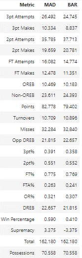
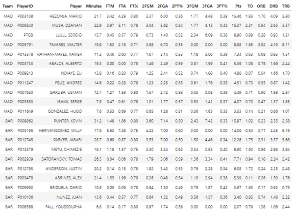

Euroleague and Eurocup Basketball Player-Driven Game Simulator

Barcelona @ Madrid - January 6 2024
Simulated Team Statistics

Simulated Box Score

Project Description:

Use euroleague_api to collect play by play, boxscore and shot location data.

Cleans and amplifies euroleague_api play-by-play data by:
    - Merging shot data and relevant boxscore data with play-by-play
    - Identifying players on the court at each moment of each game
    - Finds and addresses inconsistencies
    - Identifies and fixes potential errors
    - Breaks down start and finish of each possession
    - Eliminates garbage time possessions

Break play by play data into play specific datasets and aggregate events while each player is on the court
Unique weighting system to determine players' impact on each possession 
    - (i.e player recieves more credit for offensive possession if they took the shot)
Add in opponent offense/defense statistics for future calculations of elo ratings
Add in how each possession began (used later to increase/decrease probabilities when determining transiation matrices)

    
Calculates player level elo ratings using previously created player possession data.
Returns player impact ratings for offense/defense eFG%, OReb/DReb, TO, and FTA Rate, as well as pace.

Calculates impact of home court advantage:
    - Compilies cumulative team outcomes when teams are playing at home vs playing away on both offense and defense.
    - Uses the outcomes to create a transition matrix for the home teams, away teams, and combined.
        - Assess the impact of all major stat categories (i.e shooting percentages, offensive rebounding, fouls, etc)

Functions created to: 

    1. Use compiled player elo ratings to create transtion matrices for each team that will be simulated.
        Example:
        elif current_state == '2pt Attempt':
            outcome = np.random.choice(['2pt Make', '2pt Miss'], p=[two_made_prob, 1 - two_made_prob])
            current_state = handle_transition(current_state, outcome, transition_matrix)
    
            if outcome == '2pt Make':
                current_state = handle_transition(current_state, 'End Possession', transition_matrix)
            else:
                if np.random.random() < two_pt_oreb_prob:
                    current_state = handle_transition(current_state, '2pt Oreb', transition_matrix)
                    current_state = handle_transition(current_state, 'Initial Possession', transition_matrix)
                else:
                    current_state = handle_transition(current_state, '2pt NonOreb', transition_matrix)
                    current_state = handle_transition(current_state, 'End Possession', transition_matrix)
    
    2. Simulate possessions, games, multiple games and compile statistics

    3. Take most recent lineups, project minutes, and allow ability to manually modify any lineup for injury news.

Simulator function:

    run_full_simuluation (home_team, away_team, HFA, players_to_update, number_of_simulations, possession_adjust,
                         teamsDF, homeusage_for, awayusage_for, homeusage_against, awayusage_against)

        home_team (str): Team code (e.g., 'BAR', 'IST', 'ASV')
        away_team (str): Team code (e.g., 'MAD', 'TEL', 'RED')
        players_to_update (list): List of dictionaries to add or remove players
        number_of_simulations (int): Number of simulations (default 15000)
        HFA (float): Home court advantage (default 0.8)
        possession_adjust (float): Possession adjustment (e.g., to slow the game down by 1 possession, -1.)

    

